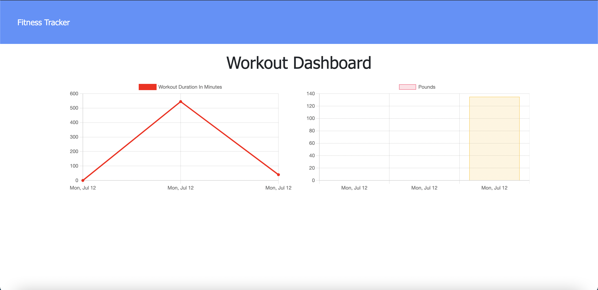

# Workout Tracker
  ## Licensing:
  
  ## Table of Contents 
  - [Description](#description)
  - [Usage](#usage)
  - [Contribution](#contribution)
  - [Testing](#testing)
  - [Questions?](#questions)
  ## Description:
  This application allows the user to view, create, and track daily workouts. The user can log in various information about the exercise and can log multiple exercises per day. The user is also able to record cardio time and distance as well. 
  
  Link to deployed application: [Workout Tracker](https://young-atoll-62653.herokuapp.com/)
  ## Usage:
  Homescreen:
  
  Workout logging:
  
  Visual tracking:
  
  
  Anyone can use this project to track their fitness goals.
  ## License:
  
  Copyright © Thang Nguyen. All rights reserved. 
  Licensed under the [MIT](https://opensource.org/licenses/MIT) license.
  ## Contribution:
  Anyone can contribute
  ## Testing:
  Please visit the deployed link to test the functionality of the application.
  ## Questions?
  - Github: [thangnt336](https://github.com/thangnt336)
  - Email: thangnt336@gmail.com 
